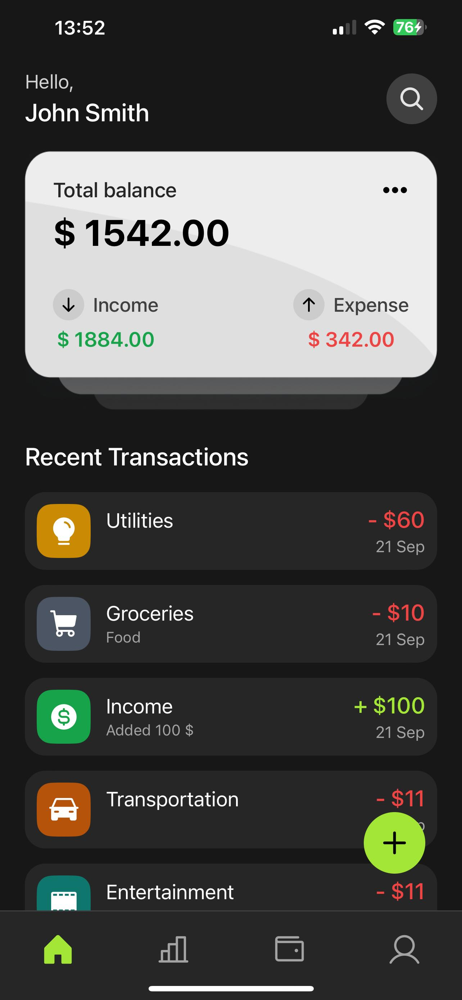
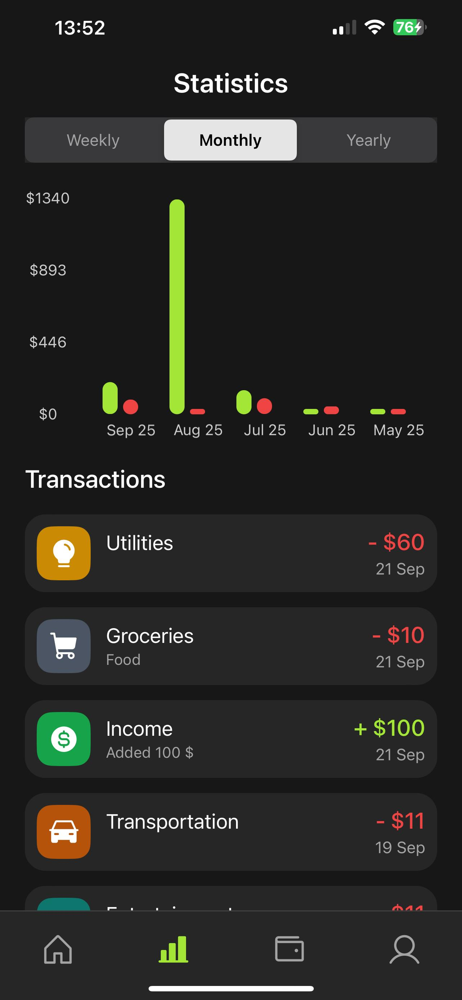
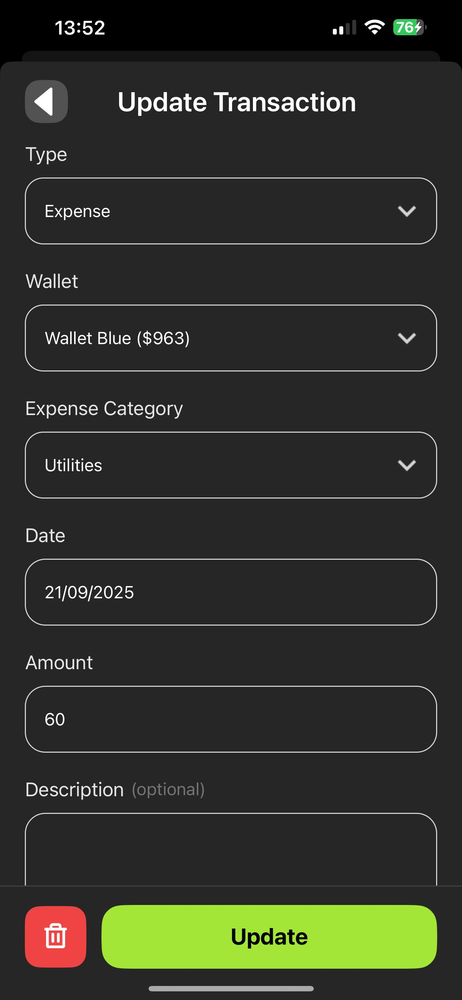
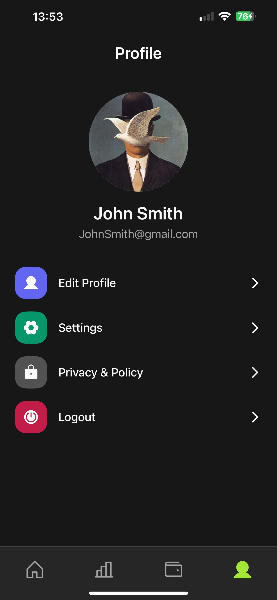

# Money Tracker

A simple **Expo + React Native** app to track your **income and expenses**.  
View **weekly, monthly, and yearly statistics** with interactive charts, filter by categories, and manage your wallets — all in one clean mobile interface.

---

## Features

- Add, edit, and delete **transactions** (income/expense)
- Support for **categories** and **wallets**
- View **statistics** (weekly / monthly / yearly) with interactive charts
- Clean **transaction list** powered by FlashList for speed
- Authentication context ready to integrate with Firebase Auth
- Responsive UI with reusable components and theme constants (colors, spacing, radius)

---

## Screens (examples)

<p align="center">
  
  
  
  
</p>

---

## Tech Stack

- **Expo (Router)** + **React Native**
- **TypeScript**
- **Firebase Firestore** (data storage, queries with `where`, `orderBy`, `limit`)
- **UI/UX Libraries:**
  - [FlashList](https://shopify.github.io/flash-list/) – high-performance lists
  - [Gifted Charts](https://www.npmjs.com/package/react-native-gifted-charts) – bar charts
  - [Segmented Control](https://docs.expo.dev/versions/latest/sdk/segmented-control/) – switch stats view
  - [Phosphor React Native](https://phosphoricons.com/) – icon set
  - [DateTimePicker](https://docs.expo.dev/versions/latest/sdk/date-time-picker/) – date input

---

## Getting Started

### 1. Clone the repo

```bash
git clone https://github.com/dumitrescuvlad/money-tracker.git
cd money-tracker
```

### 2. Install dependencies

```bash
npm install
```

### 3. Configure Firebase

Create a Firebase project and enable Firestore.  
Add your config to a local file (e.g. `src/firebase.ts`):

```ts
import { initializeApp } from "firebase/app";
import { getFirestore } from "firebase/firestore";

const firebaseConfig = {
  apiKey: "…",
  authDomain: "…",
  projectId: "…",
  storageBucket: "…",
  messagingSenderId: "…",
  appId: "…",
};

export const app = initializeApp(firebaseConfig);
export const db = getFirestore(app);
```

Make sure your `services/` (e.g., `walletServices`, `transactionService`) use this config.

### 4. Run the app

```bash
npx expo start
```

Then press:

- `a` → Android
- `i` → iOS
- `w` → Web

---

## Project Structure

```
app/                # Expo Router screens
components/         # Reusable UI components (Header, Button, etc.)
constants/          # Theme (colors, spacing, radius) + static data (categories, transactionTypes)
contexts/           # Global contexts (authContexts)
hooks/              # Custom hooks (e.g., useFetchData)
services/           # Firestore services (walletServices, transactionService)
utils/              # Helpers (styling: scale, verticalScale)
types.ts            # Shared TypeScript types
assets/             # Fonts, images, icons
```

---

## Imports / Dependencies

Here’s a full inventory of what the app currently uses:

### Core

- `react`
- `react-native`

### Expo & Routing

- `expo`
- `expo-router`

### Firebase

- `firebase/firestore` (`where`, `orderBy`, `limit`)

### UI / UX

- `@shopify/flash-list` – fast lists
- `react-native-gifted-charts` – charts
- `@react-native-segmented-control/segmented-control` – segmented tabs
- `phosphor-react-native` – icons
- `@react-native-community/datetimepicker` – date picker

### Internal (alias `@/`)

- `@/components/*` – Header, Button, HomeCard, TransactionList, Typo, ModalWrapper, Loading
- `@/constants/*` – colors, radius, spacingX, spacingY, expenseCategories, transactionTypes
- `@/contexts/authContexts` – authentication context
- `@/hooks/useFetchData` – Firestore query hook
- `@/services/*` – walletServices, transactionService
- `@/utils/styling` – scale, verticalScale
- `@/types` – shared TypeScript types

---
